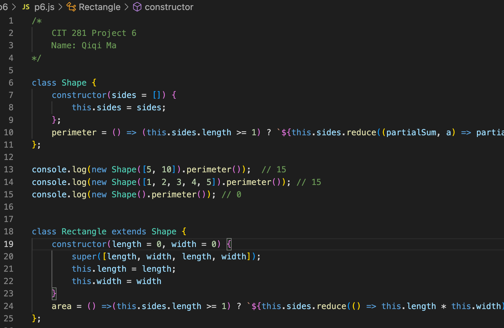

# cit281-project-6
[cit281-project-6](https://github.com/UO-CIT-qiqima/cit281-project-6)

Project 6 Overview:
I am creating three classes.
The first class is the Shape class that will serve as a base class for the other two classes and I use arrow function to calculate the perimeter of the specific shape. 
The second class is the Rectangle class that will inherit from Shape class and I use arrow function to calculate the rectangle area.
The third class is the Triangle class that also will inherit from the Shape class and I use the arrow to calculate the triangle area.

